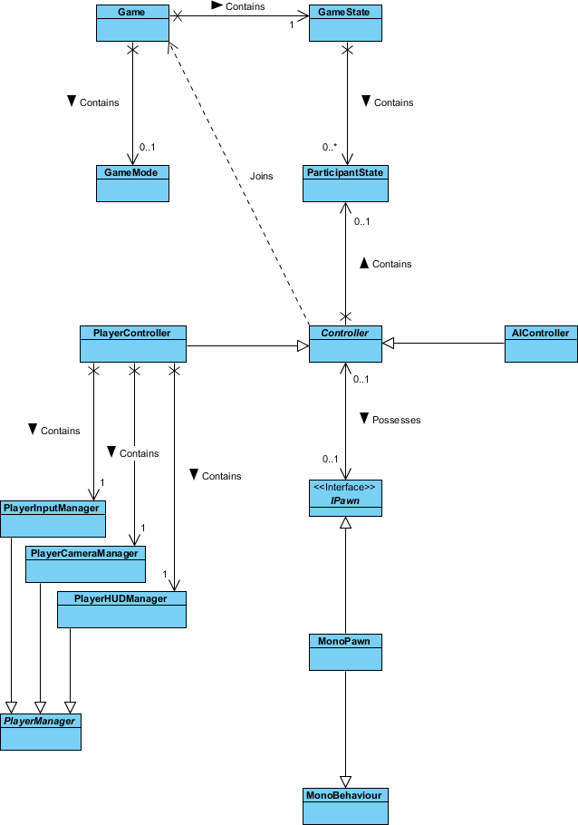

# Unity3D Gameplay Framework

## Introduction

All objects spawned in a Unity scene are <code>Behaviour</code>s. For local games we mostly work with <code>MonoBehaviour</code>s and for networking games Unity provides us <code>NetworkBehaviour</code>s. Aside from those there aren't many abstractions where Unity supports us. We basically get <code>Behaviour</code>s that support things that we often don't need (like a <code>Transform</code>) and don't get other things that would really help. I came to the conclusion that great gameplay support should be a feature that ships with the engine, finding myself abandoning projects because it doesn't. 

I've worked with Unreal's Gameplay Framework which I really like and therefore want to improve Unity's gameplay layer by adding some of the things I have learned from UE4 (Unreal Engine 4). However, the existing <code>Behaviour</code> code base cannot be removed as it lies at the heart of the Unity Engine.

## The Gameplay Framework Classes

The GF (Gameplay Framework) consist of a few classes that help to structure gameplay logic. 

#### Game Class
The <code>Game</code> class is a Singleton that provides general interaction with the game world.

#### GameState Class
The <code>Game</code> contains a single <code>GameState</code>. As the name suggests, this class stores the state of the game.

#### ParticipentState Class
The <code>GameState</code> contains multiple <code>ParticipentState</code>s. One for each participent in the game. A controller

#### GameMode Class
The <code>Game</code> contains a single <code>GameMode</code>. The mode constantly evaluates the current <code>GameState</code>. It performs check against win-/loose conditions and very specific progression based goals.

### Controller Class
Controllers are the *minds* in the game. A controller can possess a single pawn at the time and request a join.

#### PlayerController Class
A <code>PlayerController</code> is a controller that represents a real human player. In order for a human to navigate and interact with the game world the game must provide feedback to the player. This is done through the <code>PlayerManager</code>s.

#### AIController Class
An <code>AIController</code> is a controller that represent some sort of artificial intelligence. Such controllers don't contain <code>PlayerManager</code>s because they aren't real humans and don't need visual feedback to understand the world. 

### IPawn Interface
A <code>Pawn</code> is a game object that can become possessed by a single controller at a time.

#### MonoPawn Class
<code>MonoPawn</code>s are <code>Pawn</code>s that are used for local play.

#### NetworkPawn Class
<code>NetworkPawn</code>s are <code>Pawn</code>s that are used for network play. 
<code>NetworkPawn</code>s are currently not implemented due to a focus on local play for a first version of the GF.

### PlayerManager Class
A <code>PlayerController</code> has three different <code>PlayerManager</code>s that handle the interaction between the game and the player.

#### PlayerInputManager Class
A <code>PlayerInputManager</code> reads the input from the input devices and enriches the information. 

#### PlayerCameraManager Class
<code>PlayerInputManager</code>s are the camera men in a game. Their main job is to position and rotate the camera correctly.

#### PlayerHUDManager Class
<code>PlayerInputManager</code>s display the HUD (Heads Up Display). 
